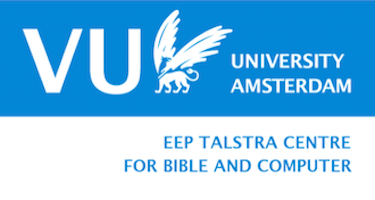

# Extra-biblical material

### BHSA Family

* [bhsa](https://github.com/etcbc/bhsa) Core data and feature documentation
* [phono](https://github.com/etcbc/phono) Phonological representation of Hebrew words
* [parallels](https://github.com/etcbc/parallels) Links between similar verses
* [valence](https://github.com/etcbc/valence) Verbal valence for all occurrences
  of some verbs
* [trees](https://github.com/etcbc/trees) Tree structures for all sentences
* [bridging](https://github.com/etcbc/bridging) Open Scriptures morphology
  ported to the BHSA
* [pipeline](https://github.com/etcbc/pipeline) Generate the BHSA and SHEBANQ
  from internal ETCBC data files
* [shebanq](https://github.com/etcbc/shebanq) Engine of the
  [shebanq](https://shebanq.ancient-data.org) website

### Extended family

* [dss](https://github.com/etcbc/dss) Dead Sea Scrolls
* [extrabiblical](https://github.com/etcbc/extrabiblical)
  Extra-biblical writings from ETCBC-encoded texts
* [peshitta](https://github.com/etcbc/peshitta)
  Syriac translation of the Hebrew Bible
* [syrnt](https://github.com/etcbc/syrnt)
  Syriac translation of the New Testament

# Sources

Conversion of some extra-biblical writings from ETCBC-encoded texts, delivered as MQL, to text-fabric format.

Part of the
[SYNVAR](https://www.nwo.nl/en/research-and-results/research-projects/i/30/9930.html)
project carried out at the 
[ETCBC](http://etcbc.nl)

* 2019-01-22: MQL Source version 0.2  obtained from Constantijn Sikkel, ETCBC

# Results

The results of this study are being delivered in several forms, summarized here.

* **Data module**: a set of 
  [features](https://github.com/ETCBC/extrabiblical/tree/master/tf)
  in **text-fabric** format, containing all text and linguistic annotations;
* **Program code**: a conversion notebook
  [Jupyter notebook](https://github.com/ETCBC/parallels/tree/master/programs/tfFromMql.ipynb)
  plus some examples how to process the material.

# Authors
* [Martijn Naaijer](mailto:m.naaijer@vu.nl) -
  [VU ETCBC](http://etcbc.nl) -
  Ph.D. student in Biblical Hebrew
* [Dirk Roorda](mailto:dirk.roorda@dans.knaw.nl) -
  [DANS](https://dans.knaw.nl/en/front-page?set_language=en) -
  author of the supporting library
  [Text-Fabric](https://github.com/Dans-labs/text-fabric).

